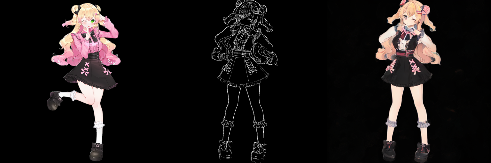
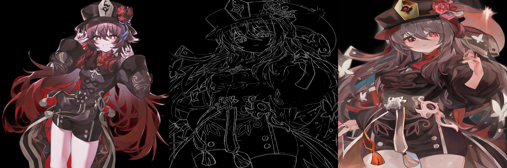
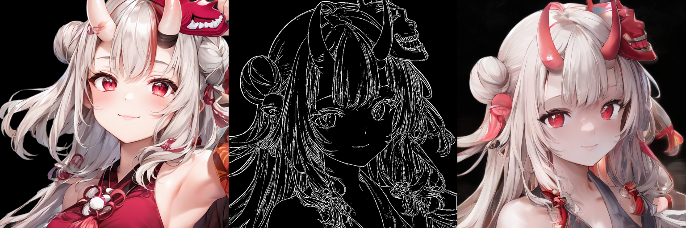
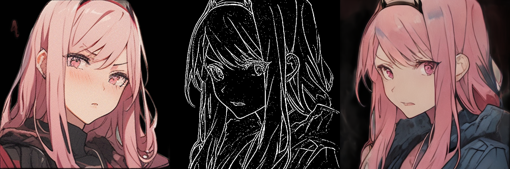
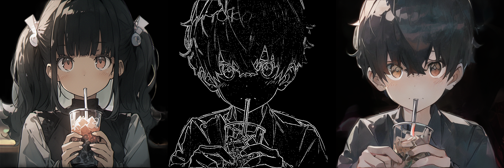

# StableDiffusionImageReferenceOnly

A general model for secondary creation.

## Online Demo

Integrated into [Huggingface Spaces 🤗](https://huggingface.co/spaces) using [Gradio](https://github.com/gradio-app/gradio). Try it out  

Try it On 

## models

[Stable Diffusion Reference Only Automatic Coloring 0.1.2](https://huggingface.co/AisingioroHao0/stable-diffusion-reference-only-automatic-coloring-0.1.2) is released. Trained for 850,000 steps on anime images at 512 resolution.

## More Examples

