# Stable Diffusion Reference Only

A general model for secondary painting.

## Online Demo

Integrated into [Huggingface Spaces 🤗](https://huggingface.co/spaces) using [Gradio](https://github.com/gradio-app/gradio). Try it out  

Try it On 

## models

[Stable Diffusion Reference Only Automatic Coloring 0.1.2](https://huggingface.co/AisingioroHao0/stable-diffusion-reference-only-automatic-coloring-0.1.2) is released. Trained for 850,000 steps on anime images at 512 resolution.

## More Examples

| input                              | input                                 | output                             |
| ---------------------------------- | ------------------------------------- | ---------------------------------- |
| 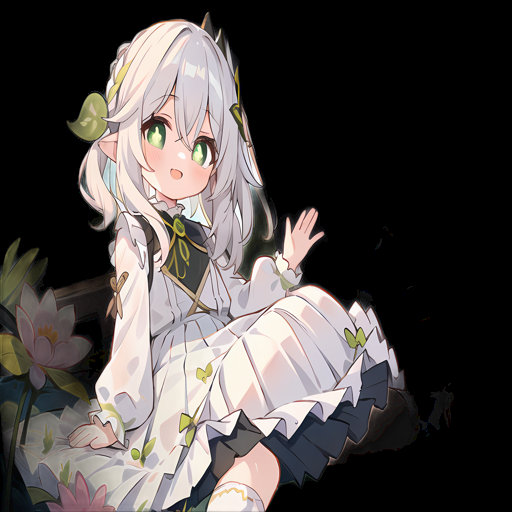  | 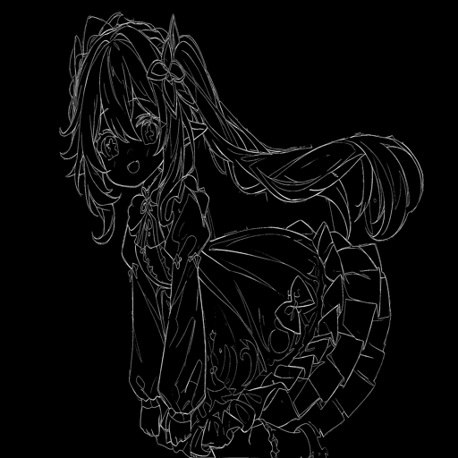  | 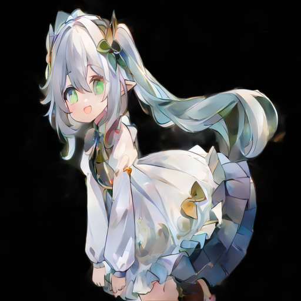  |
| 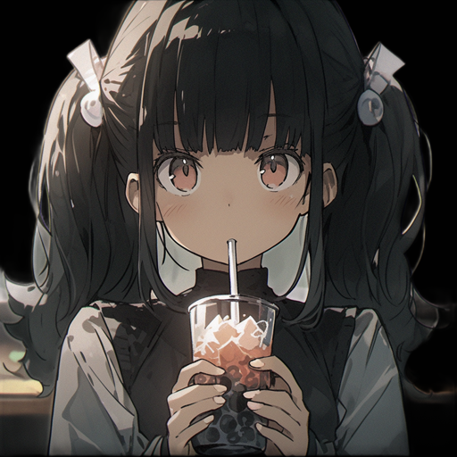 | 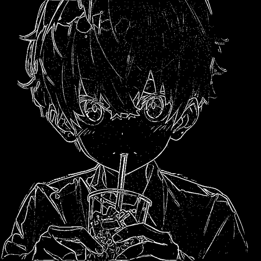 | 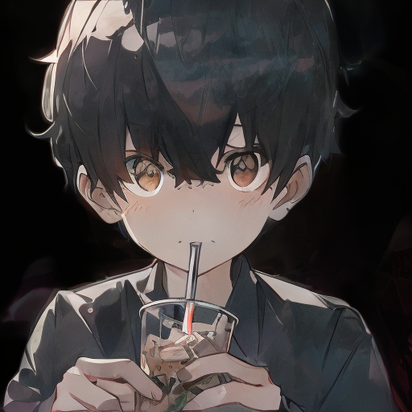 |
|  | 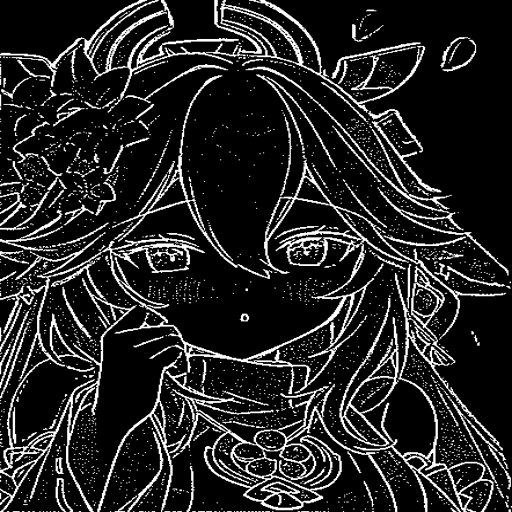 |  |
| 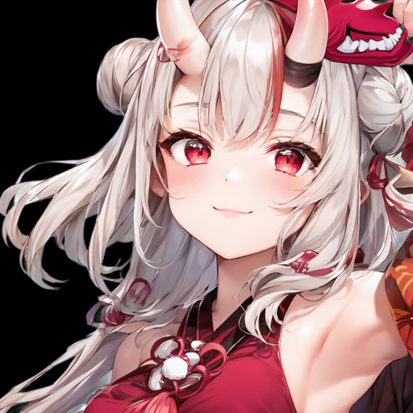  | 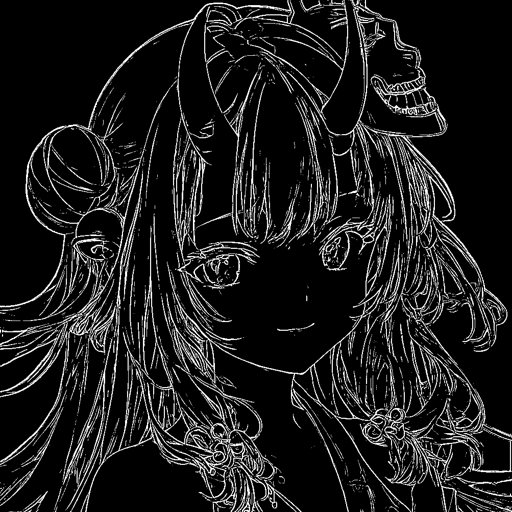  | 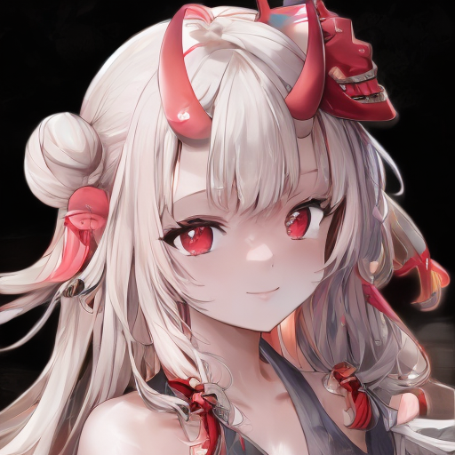  |
|  | 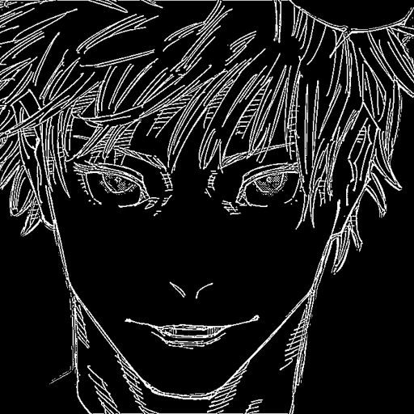 | 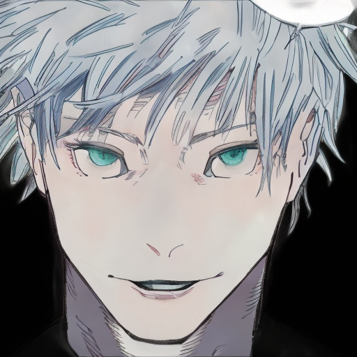 |
|  | 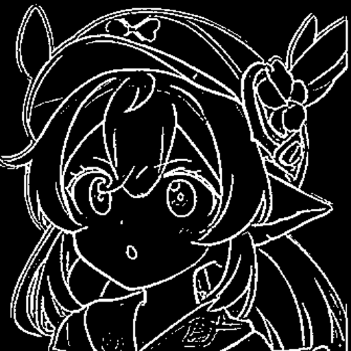 |  |

*If you are interested in better stable diffusion reference only models and have idle computing resources, feel free to contact me.*

